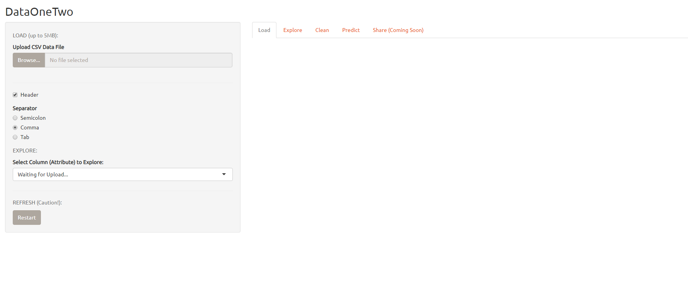
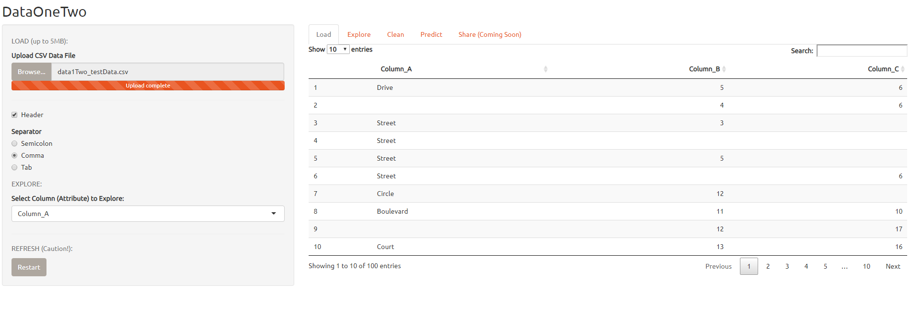
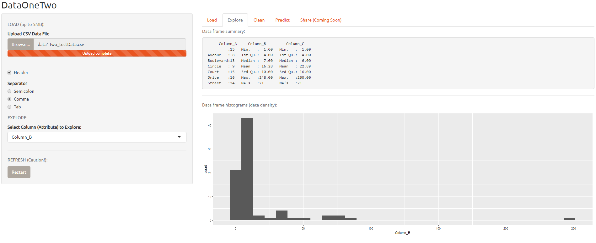
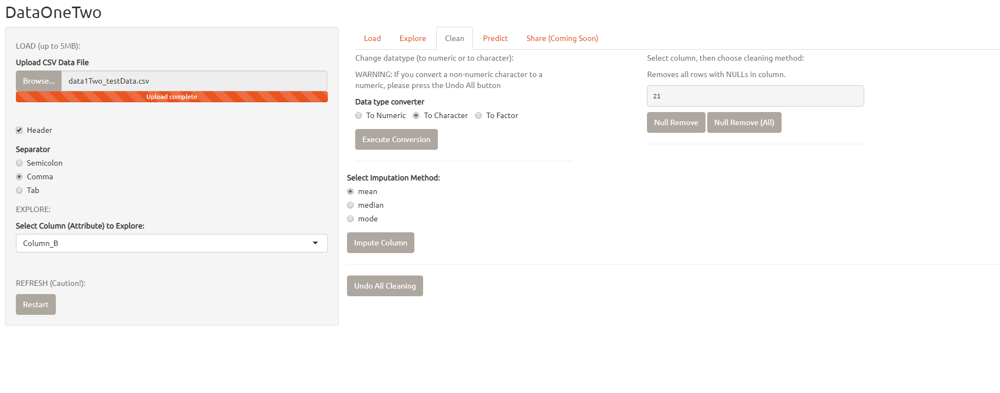
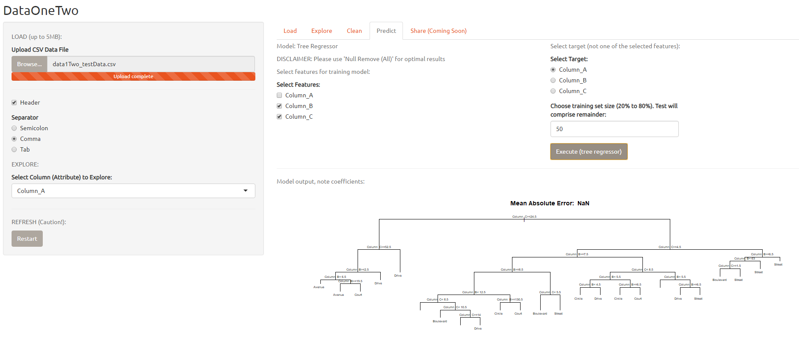
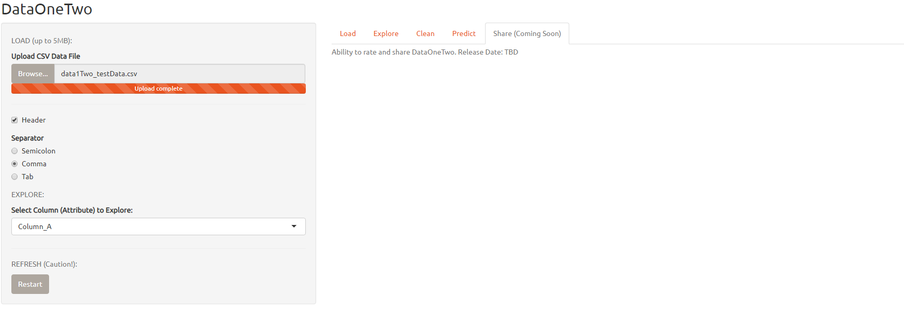

# DataOneTwo

** Version 1.0.1 (December 2018, Updated January 2020)

DataOneTwo is made as an attempt to have a front end user interface for simple machine learning.  As a web application, the design is centered to be 1) easy to use 2) follow the linear data science lifecycle 3) be nifty.

## Functionality

To load, explore, clean and predict on CSV-ONLY data sets.  Back end in R Shiny.

** ONLY TESTED ON CHROME

## Contributions

I encourage anyone and everyone interested to contribute to the project as they see fit. Treat DataOneTwo as a template.  

## Setup

DataOneTwo.r is the application code file containing both the UI and Server functions required to create an R Shiny application.  
Data1Two_testData.csv is meant as a proof-of-concept dataset.  Please feel free to use it for testing DataOneTwo.

To use the application locally:

- Download DataOneTwo.r
- Open in R Studio and execute OR run code through Terminal execution methodology for R found in your respective OS

To use as locally serviced application:

- Download DataOneTwo.r
- Setup server based application Apache HTTP server or similar web server software

To use as cloud serviced application

- Download DataOneTwo.r
- Follow instructions here for R Studio hosted Shiny application servers: https://www.rstudio.com/products/shiny/shiny-server/
- OR try cloud services like AWS, Azure and/or Google Cloud

##Sample Images
-Load. Loads the CSV file and outputs a paginated view.

  

-Explore.  Summary statistics and histograms of columns/features.  Note, only numeric data is supported by histograms.

-Clean.  Utilizing common data cleansing techniques (Ex. impute, remove nulls, convert data types).

-Predict.  Select features, target column, train/test split size.  Only supports tree regressor at this time.

-Share.  Coming soon.  Intended for feedback and sharing outputs via email and/or exports.

## Dependencies

DataOneTwo libraries and versions:

- shiny, for UI/Server functionality of webapp, *Version: 1.2.0*
- shinythemes, aesthetic theme of shiny app, *Version: 1.1.2*
- shinyjs, extends Javascript functionality to shiny, *Version: 1.0*
- dplyr, data manipulation, *Version: 0.7.8*
- ggplot2, data visualization (“Explore” tab), *Version: 3.1.0*
- hmisc, data manipulation (impute), *Version: 4.1 – 1*
- V8, Javascript engine for Chrome, *Version: 1.5*
- rpart, tree regressor model, *Version: 4.1 – 13*
- modelr, data train/test partitioning, *Version: 0.1.5*

# LICENSE

DataOneTwo is licensed under the MIT License – please LICENSE.md for details.

## Acknowledgments

The R Studio team has constructed a wonderful web application framework for R.  One that flawlessly integrates UI and Server functionalities.  For their time in creating the framework, library and tutorial/guide sets, I thank them.  This is my first Shiny application and has been a fun experience to say the least.
